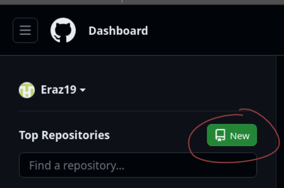
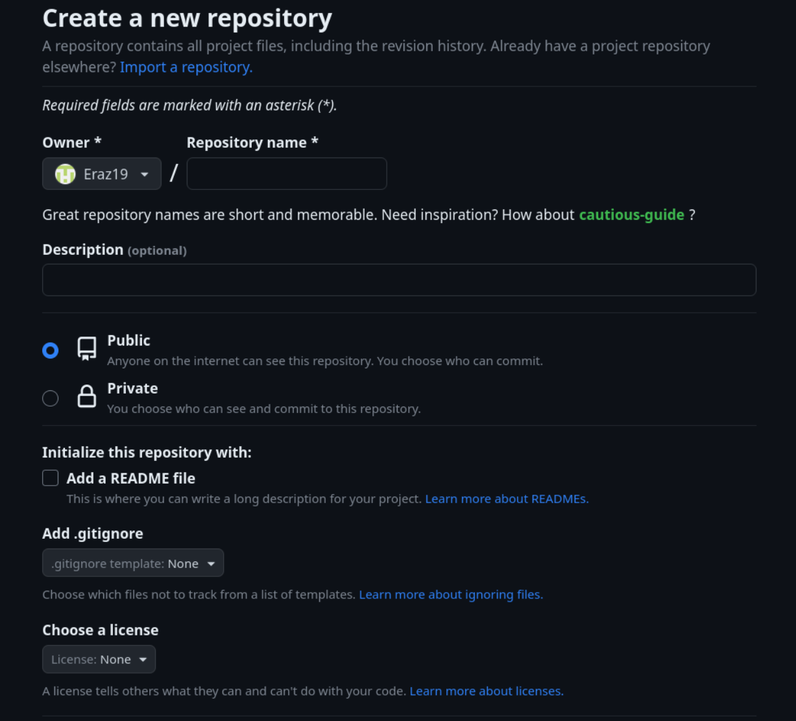
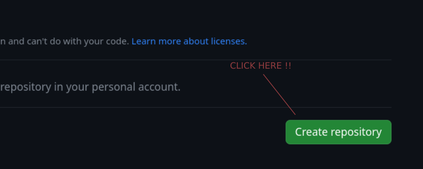

# VueTraining

## Desciption

Different little projects to learn Vuejs.

## Setup a Vuejs + Typescript

```bash
	# creates a project with Vuejs lastest version
	➜ npm init vue@latest

	# Form to setup your Vuejs project
	Project name: › <projectName>
	Package name: › <packageName> # default to project name
	Add TypeScript? › No / Yes 
	Add JSX Support? › No / Yes 
	Add Vue Router for Single Page Application development? › No / Yes
	Add Pinia for state management? › No / Yes
	Add Vitest for Unit Testing? › No / Yes
	Add an End-to-End Testing Solution? › - Use arrow-keys. Return to submit.
		No
		Cypress
		Nightwatch
		Playwright
	Add ESLint for code quality? › No / Yes

	# ...your Vuejs project is created 

	# output: Scaffolding project in <pathOfProject>...

	# output: Done. Now run:

	# output: cd <projectName>
	# output: npm install # install dependencies
	# output: npm run dev # run server

	➜ cd ./<projectName>
	➜ npm i
```

## Set git into project

For this project we use github so take this in consideration when reading the instructions. 

### Create a remote repository

1. Go to github.
2. Log in to your account.
3. Click the new repository button in the left panel.

<div align="center">
  
</div>

1. Fill the form with the name of the repository, a description of the repository, whether or not the repository is public (everyone can access it) or private etc...

<div align="center">
  
</div>

- Click the “Create repository” button.

<div align="center">
  
</div>

### Initialize local git

```bash
	➜ cd ./<projectDirectory>
	➜ git init

	# ... local git is initialized in your project

	# output: Initialized empty Git repository in /home/eraz/Documents/Alexander/Perso/Project/VueTraining/.git/

	# add for the first time all the relevant files
	➜ git add
	➜ git commit -am "<CommitMessage>"
```

### Connect local to remote git repository

```bash
	# sets the right URL of the git repository into ./.git/config
	➜ git remote add origin git@github.com:<userName>/<repositoryName>.git 
	➜ git branch -M master
	➜ git push -u origin master
```

## Code structure

This code base structure is the author preference (not perfect and can be discussed).

```shell
	.
	├── assets
	│   ├── # assets used in the project README.md
	├── env.d.ts
	├── index.html # HTML entry point (first thing the browser receives)
	├── package.json
	├── package-lock.json
	├── public
	│   └── favicon.ico # image displayed in the browser tab
	├── README.md
	├── src
	│   ├── App.vue # component with the app main layout and navigation management (router)
	│   ├── assets
	│   │   ├── # assets used in the app components
	│   ├── components
	│   │   ├── # components used in the app pages or used in other components
	│   ├── main.ts # js entry point that mount the App.vue component in the DOM
	│   ├── router
	│   │   └── index.ts # app routes to manage navigation
	│   └── views
	│       ├── # pages of the app where the components are connected to the back end
	├── tsconfig.app.json
	├── tsconfig.json
	├── tsconfig.node.json
	└── vite.config.ts
```