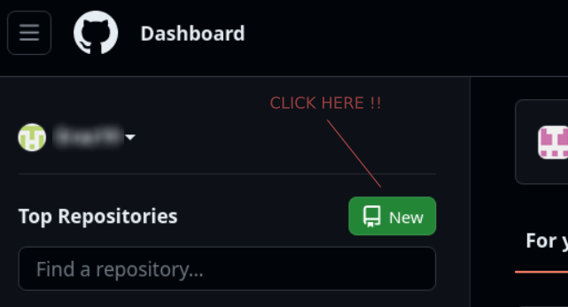
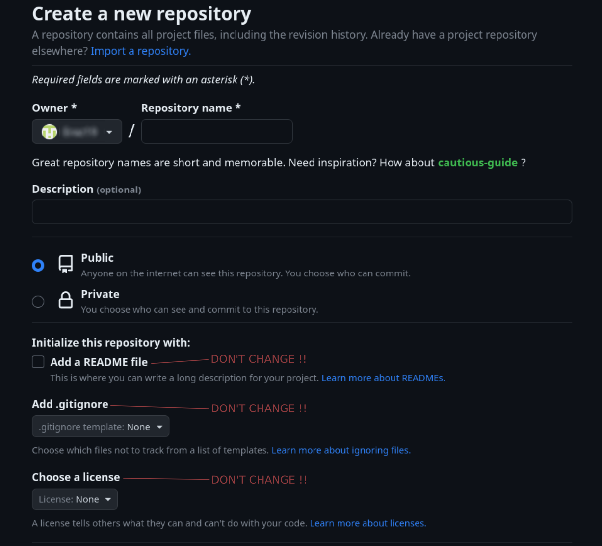

# VueTraining

## Desciption

Different little projects to learn Vue.js.

## Setup a Vuejs + Typescript

```bash
	➜ npm init vue@latest # create a a project with Vuejs lastest version

	# Form to setup your Vuejs project
	Project name: › <projectName>
	Package name: › <packageName> # default to project name
	Add TypeScript? › No / Yes 
	Add JSX Support? › No / Yes 
	Add Vue Router for Single Page Application development? › No / Yes
	Add Pinia for state management? › No / Yes
	Add Vitest for Unit Testing? › No / Yes
	Add an End-to-End Testing Solution? › - Use arrow-keys. Return to submit.
		No
		Cypress
		Nightwatch
		Playwright
	Add ESLint for code quality? › No / Yes

	# ...your Vuejs project is created 

	# Scaffolding project in <pathOfProject>...

	# Done. Now run:

	# cd <projectName>
	# npm install # install dependencies
	# npm run dev # run server

	➜ cd ./<projectName>
	➜ npm i
```

## Set git

For this project we use github so take this in consideration when reading the instructions. 

### Create a remote repository

- Go to github.
- Log in to your account.
- Click the new repository button in the left panel.

<div align="center">
  
</div>

- Fill the form with the name of the repository, a description of the repository, whether or not the repository is public (everyone can access it) or private etc... The only field we want to keep unchanged are:
  - Add a README file
  - Add .gitignore
  - Choose a license

<div align="center">
  
</div>

- Click the “Create repository” button.

<div align="center">
  
</div>

### Initialize git

```bash
	➜ cd ./<projectDirectory>
	➜ git init

	# ... git is initialized for your project

	# Initialized empty Git repository in /home/eraz/Documents/Alexander/Perso/Project/VueTraining/.git/

	➜ git add # add for the first time all the relevant files
	➜ git commit -am "<CommitMessage>"
```

### Connect project to remote git repository

```bash
	➜ git remote add origin git@github.com:<userName>/<repositoryName>.git # sets the right URL of the git repository into ./.git/config
	➜ git branch -M master
	➜ git push -u origin master
```
